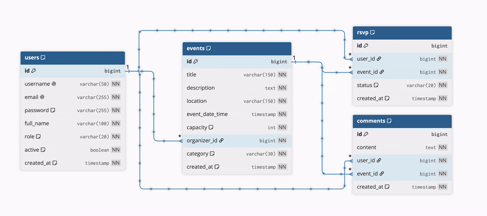

# Orbit

Orbit is a full stack event management web application built with Java and Spring Boot. Users can create and browse events, RSVP and discuss events via comments. Administrators get a dedicated panel for moderating users, events, and comments. The app comes with a server rendered Thymeleaf frontend and a documented REST API, and it runs anywhere Docker runs.

<table>
<tr><th colspan="2">Made with passion by</th></tr>
<tr><td>Saranya Sahadevan</td><td>Scrum master, developer</td></tr>
<tr><td>Marta Zapacka</td><td>PO, developer</td></tr>
<tr><td>Matthew Harris</td><td>Developer, tester</td></tr>
<tr><td>Vytautas Povilauskas</td><td>UI/UX, developer</td></tr>
<tr><td>Matīss Cišs</td><td>Developer, tester</td></tr>
</table>

## Features

**Events**
- Create, edit, and delete events (only the organizer can edit an event; the organizer or an admin can delete it)
- Browse all upcoming events with filtering: keyword search, city, category, and a from/to date range
- Ten event categories: Sports, Music, Arts, Food, Tech, Education, Gaming, Outdoors, Wellness, Other
- Event detail pages showing description, location, date and time, capacity, organizer, attendees, and comments

**RSVPs**
- RSVP to any event as Attending, Maybe, or No
- One RSVP per user per event, enforced both in the service layer and by a database unique constraint
- Capacity enforcement: an event stops accepting Attending RSVPs once the attendee count reaches its capacity
- Update or cancel your RSVP at any time
- View the attendee list for an event

**Comments**
- Post comments on event pages
- Comments are ordered chronologically and timestamped
- Users can delete their own comments; admins can delete any comment

**Authentication and authorization**
- Registration with validation and duplicate username/email detection
- Passwords hashed with BCrypt
- Session based form login for the web UI, stateless HTTP Basic auth for the API
- Two roles (USER and ADMIN) enforced through separate Spring Security filter chains and method level security
- Accounts can be deactivated without deleting data (deactivated users cannot log in)

**Admin panel**
- Manage users: list all users, activate or deactivate accounts
- Manage events: list and delete any event
- Manage comments: list and moderate comments across all events

**API documentation**
- Interactive Swagger UI generated by springdoc, with HTTP Basic auth wired into the docs so endpoints can be tried directly from the browser

## Tech stack

| Layer | Technology |
|---|---|
| Language | Java 21 |
| Framework | Spring Boot (Spring WebMVC, Spring Data JPA, Spring Security) |
| Frontend | Thymeleaf + Thymeleaf Spring Security extras |
| Database | PostgreSQL |
| Validation | Jakarta Bean Validation |
| API docs | springdoc-openapi (Swagger UI) |
| Boilerplate | Lombok |
| Testing | JUnit 5, Mockito, MockMvc, Spring Security Test |
| Build | Maven |
| Deployment | Docker, Docker Compose, GitHub Actions |

## Architecture

The application follows a layered architecture with separation between the server rendered web UI and the JSON API:

```
src/main/java/com/orbit/team
├── TeamApplication.java        # Spring Boot entry point
├── config/
│   └── SecurityConfig.java     # Two security filter chains + OpenAPI config
├── controller/
│   ├── page/                   # Thymeleaf MVC controllers (session auth)
│   │   ├── HomePageController
│   │   ├── AuthPageController
│   │   ├── EventPageController
│   │   ├── RsvpPageController
│   │   ├── CommentPageController
│   │   └── AdminPageController
│   └── rest/                   # REST API controllers (HTTP Basic auth)
│       ├── EventController
│       ├── RsvpController
│       ├── CommentController
│       ├── AdminUserController
│       ├── AdminEventController
│       └── AdminCommentController
├── dto/
│   ├── request/                # EventRequest, RsvpRequest, CommentRequest,
│   │                           # RegisterRequest
│   └── response/               # EventResponse, AttendeeResponse,
│                               # CommentResponse, UserResponse
├── entity/                     # User, Event, RSVP, Comment
│                               # + enums: Role, EventCategory, RsvpStatus
├── repository/                 # Spring Data JPA repositories
├── service/                    # EventService, RsvpService, CommentService,
│                               # UserService, AdminService
├── security/                   # UserDetailsService + UserDetails wrapper
└── exception/                  # Custom exceptions + GlobalExceptionHandler
```

Thymeleaf templates live in `src/main/resources/templates` (events dashboard, event detail, event form, login, register, and three admin pages).

### Data model


 
`users` and `events` are the two parent tables; `rsvp` and `comments` are independent children of both. 
A user organizes many events, submits many RSVPs, and writes many comments; an event receives many RSVPs and has many comments. `rsvp` also functions as a join table resolving the underlying many-to-many relationship between users and events (a user can RSVP to many events, an event can have many attendees), with a unique constraint on `(user_id, event_id)` capping each user to one RSVP per event.
 
- **User**: username (unique), email (unique), BCrypt hashed password, full name, role (USER/ADMIN), active flag, created timestamp
- **Event**: title, description, location, date and time, capacity (min 1), organizer, category, created timestamp
- **RSVP**: user, event, status (ATTENDING/MAYBE/NO), created timestamp, unique constraint on (user, event)
- **Comment**: content, user, event, created timestamp

### Security design

Two ordered `SecurityFilterChain` beans separate API and web concerns:

1. **API chain** (`/api/**`): stateless sessions, CSRF disabled, HTTP Basic auth. `/api/admin/**` requires the ADMIN role; everything else requires authentication.
2. **Web chain** (everything else): form login at `/login`, logout redirect, session based. `/login`, `/register`, and the Swagger UI are public; `/admin/**` requires ADMIN; all other pages require authentication.

Authentication is backed by a `DaoAuthenticationProvider` using a custom `UserDetailsService` that loads users from PostgreSQL. The `UserDetails` implementation maps the `active` flag to account enabled status, so deactivated users are locked out without data loss. Method level security is enabled via `@EnableMethodSecurity`.

### Error handling

A `GlobalExceptionHandler` maps domain exceptions to proper HTTP status codes:

| Exception | Status |
|---|---|
| ResourceNotFoundException | 404 Not Found |
| DuplicateUsernameException / DuplicateEmailException | 409 Conflict |
| RsvpConflictException | 409 Conflict |
| EventFullException | 409 Conflict |
| UnauthorizedActionException | 403 Forbidden |

## REST API overview

All endpoints below require HTTP Basic authentication. Full interactive documentation is available at `/swagger-ui/index.html` when the app is running. (Registration and login are handled by `AuthPageController` via session-based form login, not part of this JSON API — see `/register` and `/login`.)

### Events
| Method | Path | Description |
|---|---|---|
| GET | `/api/events` | List all events |
| GET | `/api/events/{id}` | Get a single event |
| POST | `/api/events` | Create an event |
| PUT | `/api/events/{id}` | Update an event (organizer only) |
| DELETE | `/api/events/{id}` | Delete an event (organizer only) |
| GET | `/api/events/{id}/attendees` | List attendees for an event |

### RSVPs
| Method | Path | Description |
|---|---|---|
| POST | `/api/events/{id}/rsvp` | Create an RSVP (capacity checked) |
| PUT | `/api/events/{id}/rsvp` | Change RSVP status |
| DELETE | `/api/events/{id}/rsvp` | Cancel an RSVP |

### Comments
| Method | Path | Description |
|---|---|---|
| GET | `/api/events/{eventId}/comments` | List comments for an event |
| POST | `/api/events/{eventId}/comments` | Add a comment |
| DELETE | `/api/events/{eventId}/comments/{commentId}` | Delete own comment |

### Admin (ADMIN role required)
| Method | Path | Description |
|---|---|---|
| GET | `/api/admin/users` | List all users |
| PATCH | `/api/admin/users/{id}/status` | Activate or deactivate a user |
| DELETE | `/api/admin/events/{id}` | Delete any event |
| GET | `/api/admin/comments/{eventId}` | List comments for an event |
| DELETE | `/api/admin/comments/{id}` | Delete any comment |

## Getting started

### Prerequisites

- Docker and Docker Compose (recommended), or
- Java 21 + a local PostgreSQL 16 instance

### Run with Docker Compose

```bash
git clone https://github.com/MusicFolk/Team-Orbit.git
cd Team-Orbit
docker compose up --build
```

This starts:
- `orbit-db`: PostgreSQL
- `orbit-app`: the Spring Boot app

Once healthy, open:
- Web app: http://localhost:8080 (redirects to login page)
- Swagger UI: http://localhost:8080/swagger-ui/index.html


## Testing

The test suite covers the service layer with Mockito based unit tests and the web layer with MockMvc, including security aware tests via Spring Security Test. Tests cover event CRUD and ownership rules, RSVP creation, capacity limits and conflicts, comment lifecycle, user registration and duplicate detection, and admin operations.

```bash
./mvnw test
```


## Contributors
<table> <tr> <td align="center"> <a href="https://github.com/martHaza"> <br> <sub><b>Marta Zapacka</b></sub> </a> </td> <td align="center"> <a href="https://github.com/matiss888"> <br> <sub><b>Matīss Cišs</b></sub> </a> </td> <td align="center"> <a href="https://github.com/mgharris97"> <br> <sub><b>Matthew Harris</b></sub> </a> </td> <td align="center"> <a href="https://github.com/SaranyaSahadevan"> <br> <sub><b>Saranya Sahadevan</b></sub> </a> </td> <td align="center"> <a href="https://github.com/MusicFolk"> <br> <sub><b>Vytautas Povilauskas</b></sub> </a> </td> </tr> </table>

## Project structure notes
 
- `main` started as the initial project skeleton. Active development happened on `develop` and feature branches, with `develop` merged into `main` once the project was complete.
